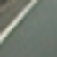

# **Vehicle Detection and Tracking**

The goals / steps of this project are the following:
* Make a pipeline that finds vehicles on the road

### Extrating Image Features

The key point to recognize objects on image is extract usefull properties and compare with known patterns. One of the most sucessful is [Histogram of Oriented Gradients] (https://en.wikipedia.org/wiki/Histogram_of_oriented_gradients). This feature extractor tries to capture the line orientation of a given image, then it is possible to compare it against car images. 

As example, for the image:

The HOG for some choose parameters is:

In this project, We choose a very simple image feature extractor. First, convert image to grayscale and compute HOG, then use a SVM Model to predict if HOG descriptor is from a Vehicle or not. We choose the following parameter for Hog function:

- image size: 64 x 64 pixels;
- orientation: 9;
- pixels per cell: 16 x 16;
- cell per block: 2

### Dataset

We have trained a SVM Model to detect Vehicles with dataset provided by Udacity. This dataset contains 18.000 (~) small color images classified as Vehicle or not. Each image is 64 x 64 pixels as:

And there are not vehicles images too:

### Model

After some tests, We choose as classifier a SVM Model with following parameters:

- Kernel: RBF;
- C: 0.200;
- gamma: 0.01.

Accuracy in train dataset is 0.98 and in test dataset is 0.96. As We have choose a very simple image extractor and model has a small number of parameters, almost there is not overfit. 

A pre-trained model that could save us time is on file **model.pkl**. To force program to retrain model, it is necessary to remove this file before.

### Evaluating the Model

The model has performed well in the dataset. But this say nothing about its performance on images taken from other camera and conditions. As a sanity check, We extract patchs from known cars and verify if model give the corrected prediction:

Prediction: VEHICLE

Prediction: VEHICLE

Prediction: NOT a VEHICLE

As We can see, the model cannot detect a car if it is far (and image is small).

### Detection on Full Images

Our model is able to predict if a small images (64 x 64 pixels) is a vehicle, but real images are larger. To detect cars in full images, We use function **slide_window** that helps to crop original image in many small patchs and predict if each small patch is a vehicle. An example could be seen in:

The trained model does not perform well on non-vehicles images and detect it as cars and, as result, the program obtains a lot of false positives. To avoid them, there are funcions *add_heat*, *apply_threshold* and *draw_labeled_bboxes*. the ideia is report as vehicles only regions that are classified as vehicles in many windows. 

Now, to report vehicles in a movie we use an additional method that stored detected vehicles in previous frames to compute an *average* and calculate the heat map.

### Pipeline

Then, the pipeline to detect vehicles in movies is:

- initialize the history of detected windows with empty list;
- iterate to window size **L** with values: 70, 100, 130, 160, 190 and 220;
- for each window size, create a list of windows to search for cars;
- crop window from original image and resize it to 64x64 pixels;
- convert cropped image to grayscale;
- extract HOG features from image;
- tell if is a vehicle or not using the SVM Model;
- update lists of detected windows and history;
- calculate the heat map;
- create result image as original frame plus the heat map.

We can see the pipeline applied in video:

[project_video.mp4](output/project_video.mp4).

### Shortcomings

I believe that the main shortcoming it is related to detect small objects. The ideia to resize every image to 64 x 64 pixels give poor image quality (resolution) for distant objects and hurts classifier performance. 

Other shortcoming is the cost of running feature extraction over and over. To reduce this cost and avoid overfitting, We have choose a very simple extractor. But the idea of select by hand good features is not productive. 

We believe that use CNN (Convolutional Neural Network) could help us in these shortcomings to get a more robust solution, but we would need a large dataset. 

